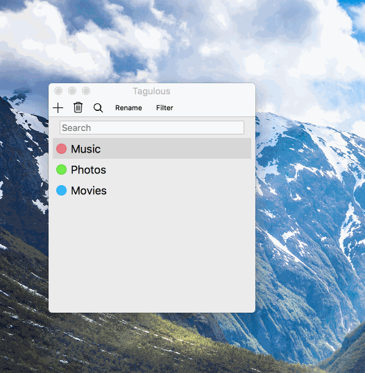

# Tagulous

This is an application to tag files. Using QT developped within an HMI course at Univ-Nantes.

## To go further

- Add a context menu on the items.
	- In TagList:
		- Rename
		- Delete
		- Copy : Copy a tag as text/uri-list and as tagulous/tag
		- Paste : As tag if in TagList (which creates copiedTag.name()+"2")
	- In FileList:
		- Delete
		- Copy : as text/uri-list
		- Paste : able to paste an text/uri-list
		- Open/Open in finder

- Use a good proxy to filter/sort the models
- Simplify the code by merging TagListWidget and FileListWidget (the code is very similar in both)
- Add a delegate (idk what it is but it seem interestinh)
- Improve the persistance (using threads), distribute the toXML function in each class (TagList::toXML calls Tag::toXML)
- TagListDrop and TagListCheckable should be decorators not inheritors
- Implementing ctrl-z would be wonderful
- Add a status bar at the bottom to display useful informations
- When a tag is created is should be in edit mode directly
